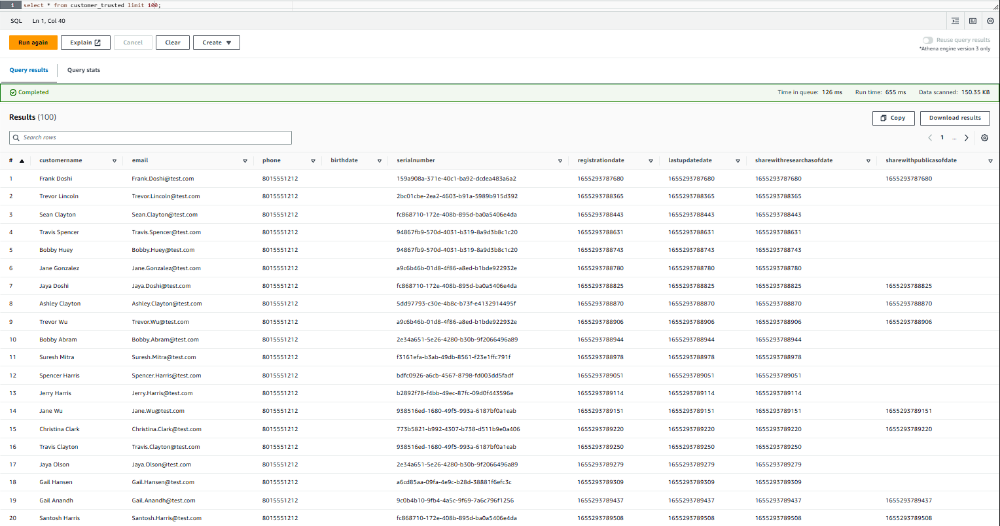

# Udacity Data Engineering Nanodegree Project: STEDI Human Balance Analytics

This project consists of extracting the data produced by the STEDI Step Trainer sensors and the mobile app, and curate them into a data lakehouse solution on AWS so that Data Scientists can train the learning model.

 

## **Project Data**

STEDI has three JSON data sources (*customer*, *accelerometer* and *step_trainer*). They were downloaded from this [link](https://video.udacity-data.com/topher/2022/June/62be2ed5_stedihumanbalanceanalyticsdata/stedihumanbalanceanalyticsdata.zip) and then uploaded in the respective  folders in an AWS S3 bucket.

 

1. **Customer Records** (from fulfillment and the STEDI website):

    - Fields: serialnumber, sharewithpublicasofdate, birthday, registrationdate, sharewithresearchasofdate, customername, email, lastupdatedate, phone, sharewithfriendsasofdate.

 

2. **Accelerometer Records** (from the mobile app):

    - Fields: timeStamp, user, x, y, z.

 

3. **Step Trainer Records** (data from the motion sensor):

    - Fields: sensorReadingTime, serialNumber, distanceFromObject.

 

## **Landing Zone**
---

In the Landing Zone were stored the *customer, accelerometer and step trainer raw data*.

### **Glue table (DDL)**
The code for the creation of the Glue tables can be found in the following scripts:
- [customer_landing.sql](./code/customer_landing.sql)
- [accelerometer_landing.sql](./code/accelerometer_landing.sql)

### **Athena query results**

The customer and accelerometer landing tables were queried in Athena and the results are shown in the screenshots below:

 

## **Trusted Zone**
---

In the Trusted Zone were stored the tables that contain the records from *customers who agreed to share their data* for research purposes.

### **Glue job scripts**
The scripts below were downloaded from the Glue job editor. They were used to transform the landing tables into trusted tables.

- [customer_landing_to_trusted.py](code/customer_landing_to_trusted.py): script used to build the **customer_trusted** table, which contains customer records from customers who agreed to share their data for research purposes.

- [accelerometer_landing_to_trusted_zone.py](code/accelerometer_landing_to_trusted.py): script used to build the **accelerometer_trusted** table, which contains accelerometer records from customers who agreed to share their data for research purposes.

### **Athena query results**
The **customer_trusted** table was queried in Athena to show that it only contains customer records from people who agreed to share their data.

 

## **Curated Zone**
---
In the Curated Zone were stored the tables that contain the *correct serial numbers*.

### Glue job scripts
- [customer_trusted_to_curated.py](code/customer_trusted_to_curated.py): script used to build the **customer_curated** table, which contains customers who have accelerometer data and have agreed to share their data for research.

- [step_trainer_trusted_to_curated.py](code/step_trainer_trusted_to_curated.py): script used to build the **machine_learning_curated** table, which contains each of the step trainer readings, and the associated accelerometer reading data for the same timestamp, but only for customers who have agreed to share their data.